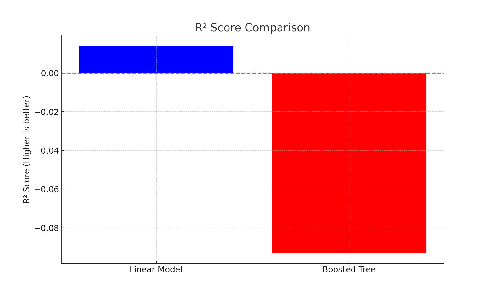

# Spotify Data Engineering & ML Project on GCP

## Overview
This project demonstrates how to build a complete cloud-native data pipeline and machine learning model using Google Cloud Platform (GCP). The goal is to analyze and predict the popularity of Spotify tracks using BigQuery ML and audio feature data.

## Project Setup
- **GCP Project**: Created a project named `melodies`.
- **APIs Enabled**: Cloud Storage, BigQuery, IAM.
- **Storage Bucket**: `test513` (Multi-region, Fine-grained access).
- **Dataset**: `dataset_playlist_2010to2022.csv`.

## Data Processing
- **BigQuery Dataset**: `spotify_data`.
- **Table**: `playlist_data` (auto-detect schema).
- **Data Cleaning**: Removed nulls and created a clean table.

## Analysis & ML
- **Trend Analysis**: Top artists and genre popularity by year.
- **ML Model**: Linear regression to predict track popularity.
- **Evaluation**: R^2 Score: ~0.014, MAE: ~8.7, Median AE: ~7.2.
- **Predictions**: Predicting track popularity.

## Business Value
- Predict track popularity for marketing and curation.
- Analyze musical trends and genre dynamics.
- Enable AI tools for music intelligence.

## Next Steps
- Add advanced features.
- Switch to BOOSTED_TREE_REGRESSOR.
- Build interactive tools like dashboards or chatbots.

## Tools Used
- GCP: BigQuery, Cloud Storage, IAM
- SQL
- BigQuery ML

## Diagram
!Workflow Overview

## 🔄 Improving the ML Model – Boosted Tree Regressor (BigQuery ML)

After training a baseline linear regression model to predict `track_popularity`, I tested a more advanced ML algorithm — `BOOSTED_TREE_REGRESSOR` — using BigQuery ML.

### 🎯 Objective:
Evaluate whether a boosted ensemble tree model could better capture the nonlinear relationships between track features and popularity.

### 📥 Features Used:
- `danceability`
- `energy`
- `valence`
- `tempo`
- `duration_ms`

### 🧪 Training Query:
```sql
CREATE OR REPLACE MODEL `melodies-459020.spotify_data.boosted_tree_model`
OPTIONS(
  model_type = 'BOOSTED_TREE_REGRESSOR',
  input_label_cols = ['track_popularity'],
  max_iterations = 50
) AS
SELECT
  danceability,
  energy,
  valence,
  tempo,
  duration_ms,
  track_popularity
FROM `melodies-459020.spotify_data.cleaned_playlist_data`
WHERE track_popularity IS NOT NULL;

### Image Links:



